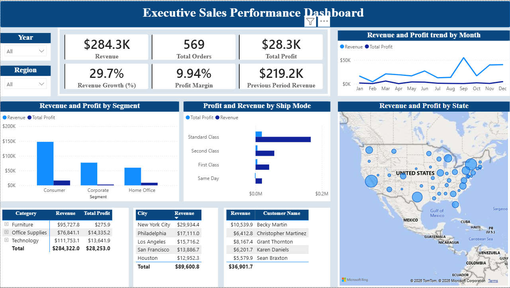

# Executive Sales Performance Dashboard

## 📊 Project Overview
An enterprise-grade Power BI dashboard developed to track macro-level financial performance, sales distributions, and operational logistics for a retail enterprise. This interactive application empowers executives with dynamic, cross-filtered deep-dives across time, geography, product categories, and top-tier client segments to drive data-backed business decisions.

### 🌟 Key Features & Insights Built:
* **Macro Financial KPIs:** Displays $284.3K in Total Revenue, 569 Total Orders, and an optimized 9.94% Profit Margin alongside Time-Intelligence metrics (29.7% Revenue Growth).
* **Temporal Trend Analysis:** Features a chronologically sorted timeline charting monthly Revenue and Profit performance from January to December.
* **Spatial/Geographic Analytics:** Incorporates an interactive regional map pinpointing high-volume sales states and bubble sizing based on revenue weight.
* **Operational Logistics Slicing:** Provides a side-by-side comparative analysis of delivery efficiency and volume across shipping modes (*Standard Class, Second Class, First Class, Same Day*).
* **Granular Drill-Downs & Leaderboards:** Integrates a hierarchical Category/Sub-Category breakdown matrix and a dynamic Customer Revenue leaderboard that reacts seamlessly to global filters.

---

## 📷 Dashboard Preview

---

## 🛠️ Technical Stack & Skills Demonstrated
* **BI Tool:** Power BI Desktop
* **Data Transformation & Modeling:** Power Query (ETL), custom Star Schema data modeling, and custom sort configurations.
* **Advanced Analytics (DAX):** Formulated highly critical corporate measures including:
  * `Total Revenue` & `Total Profit`
  * `Profit Margin %`
  * `Previous Period Revenue` (Time-Intelligence)
  * `Revenue Growth (%)`
* **Data Source:** Cleaned and structured relational dataset (`sales_and_profit_trends.csv`).

---

## 🚀 How to Run and Interact with the Report
1. Clone this repository to your local machine.
2. Open the `.pbix` file inside the `reports/` directory using **Power BI Desktop**.
3. If prompted, adjust the data source settings to point to the local copy of `sales_and_profit_trends.csv` inside the `data/` folder.
4. Use the **Year** and **Region** slicers on the left panel, or click directly on the map bubbles and chart bars to experience full, interactive cross-filtering across the entire canvas.
